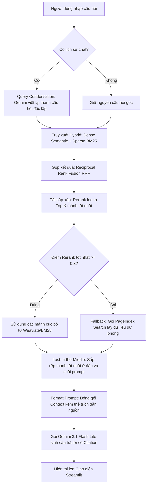

# Hướng Dẫn Demo & Tài Liệu RAG Pipeline (Tasks 1 - 10)

Tài liệu này tóm tắt ngắn gọn cấu trúc hệ thống RAG Tra cứu Luật Ma tuý từ Task 1 đến Task 10 và cơ chế hoạt động của Chatbot phục vụ buổi thuyết trình/demo.

---

## 1. Tóm Tắt Nhiệm Vụ (Task 1 - Task 10)

| Task | Tên Nhiệm Vụ | Nội Dung & Vai Trò | Công Nghệ Sử Dụng |
| :--- | :--- | :--- | :--- |
| **Task 1** | Thu thập văn bản | Thu thập các văn bản pháp lý dạng PDF phục vụ RAG. | PDF Documents |
| **Task 2** | Thu thập tin tức | Crawl các bài báo liên quan đến án ma tuý để làm phong phú dữ liệu thực tế. | News JSON/HTML |
| **Task 3** | Chuẩn hóa dữ liệu | Chuyển đổi toàn bộ PDF/Báo chí sang Markdown sạch để tối ưu hóa việc phân tách. | PyPDF/Markdown |
| **Task 4** | Phân mảnh & Nhúng | Cắt nhỏ văn bản (500 chars, overlap 50) và chuyển thành vector 384-chiều. | Sentence-Transformers (`all-MiniLM-L6-v2`) |
| **Task 5** | Tìm kiếm ngữ nghĩa | Lưu trữ và tìm kiếm vector tương đồng trên Vector Database. | Local Weaviate (`v1.27.0`) |
| **Task 6** | Tìm kiếm từ khóa | Tìm kiếm văn bản theo tần suất từ khóa chính xác để bổ trợ cho tìm kiếm ngữ nghĩa. | Thuật toán BM25 (`rank-bm25`) |
| **Task 7** | Tái sắp xếp kết quả | Rerank kết quả sau khi gộp để đưa các mảnh quan trọng nhất lên hàng đầu. | Jina Reranker v2 API / Local Similarity |
| **Task 8** | PageIndex Fallback | Cơ chế tìm kiếm không vector (Vectorless) phân tích cấu trúc tài liệu làm phương án dự phòng. | PageIndex Client SDK |
| **Task 9** | Pipeline tích hợp | Hợp nhất Semantic + Lexical + RRF + Rerank và tự động kích hoạt PageIndex nếu điểm số < 0.3. | RRF, Fallback Logic |
| **Task 10** | Sinh câu trả lời | Sinh câu trả lời tiếng Việt mạch lạc, kèm theo citation (trích dẫn nguồn tài liệu cụ thể). | Google Gemini API (`gemini-3.1-flash-lite`) |

---

## 2. Luồng Hoạt Động Của Chatbot (Chatbot Workflow)

Khi người dùng nhập câu hỏi vào **Chat Console**:

---

## 3. Các Điểm Sáng Kỹ Thuật Đáng Chú Ý (Key Selling Points)

1. **Khắc phục hiện tượng "Lost in the Middle":**
   * Các mô hình LLM thường quên thông tin nằm ở giữa Prompt dài. Hệ thống áp dụng thuật toán sắp xếp lại các mảnh tài liệu truy xuất được theo mô hình đầu-cuối: mảnh quan trọng nhất xếp đầu tiên, mảnh quan trọng nhì xếp cuối cùng, các mảnh kém quan trọng hơn nằm ở giữa.
2. **Tìm kiếm lai kết hợp dự phòng (Hybrid + Fallback):**
   * Kết hợp cả thế mạnh hiểu ngữ nghĩa của **Vector Search (Dense)** và thế mạnh tìm từ khóa chính xác của **BM25 (Sparse)**.
   * Nếu dữ liệu cục bộ không đủ tốt, hệ thống tự động fallback sang cơ chế **Vectorless Search trên PageIndex.ai** phân tích cấu trúc tài liệu PDF để tìm câu trả lời.
3. **Trích dẫn nguồn thông minh (Structured Citations):**
   * Không trả lời chung chung. Mỗi thông tin thực tế đưa ra đều đi kèm định danh tài liệu cụ thể (ví dụ: `[Bộ luật Hình sự, Điều 249]`), giúp người dùng dễ dàng đối chiếu tính xác thực.
4. **Hỗ trợ Follow-up nhờ Trí tuệ Nhân tạo:**
   * Sử dụng Gemini để phân tích ngữ cảnh chat cũ, tự động hiểu các đại từ thay thế (như *"Tội này bị phạt bao lâu?"* -> *"Tội tàng trữ trái phép chất ma túy bị phạt bao lâu?"*), đảm bảo quá trình hội thoại diễn ra tự nhiên.
